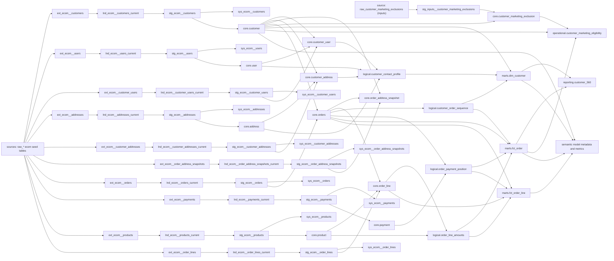
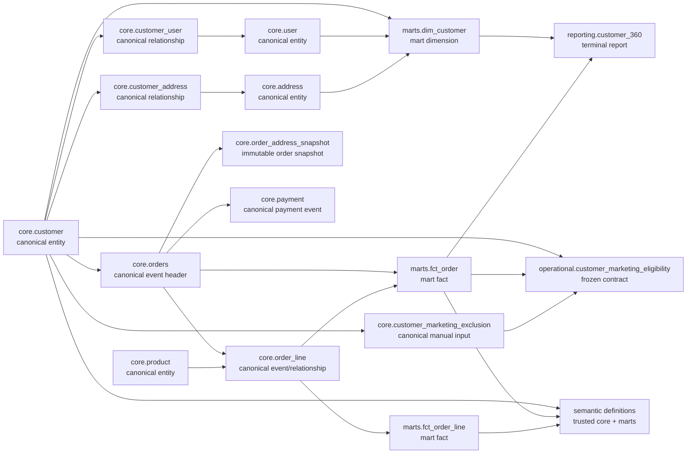

# Layered dbt Reference Architecture

This project is a compact reference implementation of a governed dbt architecture.

**Foundation is layered. Consumption is branched.**

```text
Sources / Manual Inputs -> Landing -> Staging -> { Systems (terminal source-aligned branch)
                                                    Core -> Logical (optional) -> Marts (optional facts+dimensions) }

Core, Logical, and Marts may each independently feed Reporting, Semantic, and Operational.
```

This is **not** a mandatory sequence of toll booths. The mandatory discipline is the trusted
business foundation through Core (Source -> Landing -> Staging -> Core). After Core, a model
takes the *shortest sensible trusted path* to whatever consumes it -- Logical and Marts exist to
be used when they add reuse or value, not because the diagram has boxes in a row. Systems is a
separate, terminal, source-aligned access branch off Staging; it never participates in the Core ->
Logical -> Marts chain.

## Shortest Sensible Trusted Path

A downstream consumer (a report, a semantic metric, an operational delivery contract) should read
from the *lowest* layer that already gives it what it needs, trusted and de-duplicated of joins it
would otherwise have to redo:

- If Core already has the canonical entity/event shape needed, consume Core directly. Don't route
  through Logical or Marts just because they exist.
- If a reusable derived interpretation already exists in Logical (a status, a sequence, an
  aggregation), consume that instead of re-deriving it from Core.
- Only go through Marts when the consumer genuinely wants a governed, reusable fact or dimension
  shape (conformed keys, a stable grain, general-purpose measures) -- not a report-specific shape.

In this project: `reporting.customer_360` reads `marts.dim_customer` and `marts.fct_order`
directly because both are already reusable, general-purpose marts, so that is the shortest
sensible trusted path. `operational.customer_marketing_eligibility` reads `core.customer`,
`marts.fct_order`, and `core.customer_marketing_exclusion` directly -- it does **not** route
through `reporting.customer_360`, even though it needs similar order-activity numbers, because
Operational must never depend on Reporting (Reporting is a terminal leaf; see below).

## The Rule Of Two

This is a judgement heuristic for when to extract shared logic upstream (into Logical, or into a
shared Core interface), stated precisely so it isn't misread as "wait for a third consumer":

- **One use case:** take the shortest sensible trusted path. Don't pre-abstract into Logical/Marts
  on the speculation that something else might need it later.
- **A second genuine consumer that repeats material joins or business rules** (not trivial
  aggregation -- real logic: statuses, sequencing, multi-table joins, business rules that could
  drift out of sync if duplicated) is the trigger to **review** whether that logic should be
  promoted upstream. It is a prompt to look, not an automatic mandate to extract -- the review may
  still conclude the duplication is fine.
- **Trivial repeated aggregation may simply stay duplicated.** Concretely in this repo: both
  `reporting.customer_360` and `operational.customer_marketing_eligibility` compute a small
  order-activity aggregation (first/last order date, order count, completed count, completed
  revenue, has-repeat-order) directly from `marts.fct_order`. This is a five-line `group by` with no
  business-rule content to drift; extracting it into a fifth Logical model would add an indirection
  hop for both consumers without removing any real risk or duplicated judgement, so it stays
  duplicated. (This example remains valid after the order-line monetary semantics fix: both places
  aggregate `captured_paid_amount`/`order_total`, not any current-catalogue-derived value.)

## Layer Purpose And Allowed Dependencies

| Layer | Purpose | Allowed upstream dependencies |
| --- | --- | --- |
| Source / Manual Inputs | Raw source fixtures (seeds standing in for real source systems and governed manual inputs). | `source()` only |
| Source / JSON landing | Source-faithful semi-structured CDC records with extraction and ingestion metadata. | `source()` only |
| landing | Current trusted source record selected from CDC events. | Source / JSON landing |
| staging | Source-specific renames, casts, standardisation, and source metadata. | landing |
| systems | Controlled access views over current, source-conformed staging data. Terminal: nothing downstream (core, logical, marts, reporting, semantic, operational) may depend on systems. | staging only |
| core | Canonical durable business entities/events/relationships at stable grains, free of order-derived or other behavioural drift. | staging |
| logical | Reusable derived transformations: joins, sequencing, reconciliation, and derived states, built on top of Core. | staging (only for the Manual Inputs staging model feeding into Core; all other logical models read Core) and core |
| marts | Reusable analytical facts and dimensions only (no reports). | core and logical |
| reporting | Consumer-facing, bounded reports and decision views. Terminal: nothing may depend on reporting. | core, logical, and/or marts, whichever is the shortest sensible trusted path |
| semantic | Metric and entity definitions. | core, logical, and/or marts; never reporting |
| operational | Frozen, machine-consumed delivery contracts. | core, logical, and/or marts; never reporting |

Tests, freshness, contracts, ownership, documentation, certification, and observability are
**cross-cutting concerns applied across every layer above**, not a dedicated layer of their own.
There is no `models/6. operations` serving layer; quality controls live as `data-tests/quality/*`
singular tests and as YAML-declared generic tests/contracts/freshness attached directly to the
models they protect.

## Lineage



Note what does **not** appear: nothing points out of `systems` (terminal), nothing points out of
`c360` / reporting (terminal), and `elig` (operational) has no edge from `c360`.

## Declared Model Grains

| Model | Grain |
| --- | --- |
| `ext_ecom__customers` | One source customer CDC event |
| `ext_ecom__users` | One source user CDC event |
| `ext_ecom__customer_users` | One source customer-user relationship CDC event |
| `ext_ecom__addresses` | One source address CDC event |
| `ext_ecom__customer_addresses` | One source customer-address relationship CDC event |
| `ext_ecom__order_address_snapshots` | One source order address snapshot CDC event |
| `ext_ecom__orders` | One source order CDC event |
| `ext_ecom__payments` | One source payment CDC event |
| `ext_ecom__products` | One source product CDC event |
| `ext_ecom__order_lines` | One source order-line CDC event |
| `lnd_ecom__*_current` | One current source key per entity |
| `stg_ecom__*` | One current ecom object per entity |
| `stg_inputs__customer_marketing_exclusions` | One current customer marketing-exclusion input record |
| `sys_ecom__*` | One current ecom object per entity, projected from staging |
| `logical.order_payment_position` (`int_order_payment_position`) | One order payment position |
| `logical.customer_order_sequence` (`int_customer_order_sequence`) | One order in customer sequence |
| `logical.order_line_amounts` (`int_order_line_amounts`) | One order line with commercial interpretation |
| `logical.customer_contact_profile` (`int_customer_contact_profile`) | One customer current contact/address selection |
| `core.customer` | One canonical customer |
| `core.user` | One canonical user |
| `core.customer_user` | One canonical customer-user relationship |
| `core.address` | One canonical address |
| `core.customer_address` | One canonical customer-address relationship |
| `core.order_address_snapshot` | One immutable order address snapshot |
| `core.orders` | One canonical order (physically aliased `orders`; ORDER is a Snowflake reserved word -- the dbt model/file/ref stays named `order`) |
| `core.payment` | One canonical payment |
| `core.product` | One canonical product |
| `core.order_line` | One canonical order line |
| `core.customer_marketing_exclusion` | One customer marketing-exclusion decision record |
| `marts.fct_order` | One order |
| `marts.fct_order_line` | One order line |
| `marts.dim_customer` | One current analytical customer dimension row |
| `reporting.customer_360` | One current customer |
| `operational.customer_marketing_eligibility` | One customer audience identity |
| `semantic.metricflow_time_spine` | One calendar day for semantic metric joins |

## Model Maturity (Orthogonal To Layer)

Layer says *where* a model sits in the dependency chain. Maturity says *how safe it is to build
on*. They are independent axes, declared via `meta.maturity` (folder default in `dbt_project.yml`,
overridden per model where it genuinely differs):

| Maturity | Meaning | Typical layer default |
| --- | --- | --- |
| `private` | Internal to its layer; not an interface other layers should treat as stable. | Staging, Systems, Landing/external |
| `reusable` | Safe to build on, but not yet a fully governed interface. | Logical, Marts (dimensions) |
| `certified` | A governed, stable interface -- the canonical way to get this data. | Core, Marts (facts), Semantic, Operational |
| `consumer_specific` | Built for one consumer's shape; do not build further models on top of it. | Reporting |

This project certifies every Core model because each one is a genuine canonical interface
(Customer, User, Address, Product, Order, Order Line, Payment, and their relationship/event
records) -- none of them are speculative or half-finished, so blanket-certifying Core is a
deliberate judgement call here, not a rubber stamp. `marts.dim_customer` is `reusable` rather than
`certified` because its attribute selection (which contact fields, which behavioural flags) is a
deliberate analytical choice rather than an unambiguous canonical shape.

## Why Each Transformation Belongs Where It Is

The Source / JSON landing layer constructs JSON/CDC-shaped records from explicit ecom seed tables and keeps ingestion metadata next to extracted JSON fields. It does not interpret business meaning. Products and order lines use the existing `raw_products` and `raw_items` seeds; because `raw_items` is one row per purchased item, the synthetic order-line payload sets `quantity` to `1`. Users, customer-user relationships, addresses, customer-address relationships, and immutable order address snapshots are first-class raw seed tables generated deterministically for the architecture playground, then ingested through their own external models.

The landing layer is the only place that resolves CDC currentness. The selected row wins by `source_updated_at desc, ingested_at desc, ingestion_event_id desc`, which is deterministic and covered by a unit test.

The staging layer makes records usable with renamed columns, casts, standardised text, and useful source metadata. It does not join sources or calculate business metrics. `models/1. staging/inputs` follows the same pattern for the Manual Inputs marketing-exclusions source (see below).

The systems branch exists only for controlled access to current source-conformed datasets without granting private staging access. Every system model is a materialized view and a direct `dbt_utils.star()` projection of one staging model. Systems is a terminal access branch: it never feeds core, logical, marts, reporting, semantic, or operational.

**Core** declares canonical durable entities, relationships, and events at stable grains, and is the mandatory foundation everything else builds on. `core.customer` is deliberately narrow: identity and source metadata only. It used to also carry `first_ordered_at` / `last_ordered_at` / `lifetime_order_count` / `is_repeat_customer`, sourced from order activity -- that was wrong, because it made the canonical Customer record change shape based on order behaviour rather than customer identity. Those attributes now live in `marts.dim_customer` (sourced from `logical.customer_order_sequence`), where behavioural, order-derived context belongs. `core.customer_user` and `core.customer_address` stay in Core, not Logical, because they are source-native relationship records with their own source relationship ids and validity windows -- they are canonical facts about the business, not a derived interpretation. `core.order_line` is the canonical source order-line record built directly from staging; it does not carry commercial interpretation (extended amounts, product context), which is Logical's job.

Customer key lineage is canonicalized in Core: staging customer records generate `core.customer.customer_sk`; staging order records join to `core.customer` and carry `core.orders.customer_sk`; `marts.fct_order.customer_sk` is selected from `core.orders` and never regenerated in the mart. Product/order-line key lineage is canonicalized the same way through `core.product` and `core.order_line`.

**Logical** owns reusable derived transformations built on top of Core (not Staging -- this was a dependency-direction bug in the previous iteration of this reference and has been corrected). `logical.order_payment_position` joins `core.orders` + `core.payment`. `logical.customer_order_sequence` sequences `core.orders`. `logical.order_line_amounts` joins `core.order_line` + `core.product` for line commercial amounts; its `current_catalogue_unit_price`/`current_catalogue_line_value`/`current_product_name` columns are explicitly, unambiguously prefixed `current_`/`current_catalogue_` because they are the *current* product record joined on at transformation time, not an at-purchase snapshot -- the underlying seed/source data has no purchase-time price or name history, so claiming an unqualified "unit_price"/"line_amount" here would misrepresent current catalogue pricing as historical transactional fact. `logical.customer_contact_profile` joins `core.customer_user` + `core.customer_address` (resolving through `core.user` / `core.address`) to select the current primary contact/address -- it is the derived, enriched business view that a hypothetical `logical.customer_addresses` would otherwise be; a separate model for that was judged unnecessary since `customer_contact_profile` already covers it. Payment completeness, operational status, commercial status, completion flags, and overpayment flags are based on captured payment value only; pending payment attempts remain diagnostics and do not create settled revenue. Zero-value orders are classified explicitly as `no_charge` / `not_required` and are not counted as completed revenue events.

**Marts** contain only reusable facts and dimensions -- no reports. `fct_order` and `fct_order_line` are conformed facts built from Core + Logical. `dim_customer` is the right place for repeat-order behavioural attributes (moved here from Core, see above) because it resolves current contact/address attributes *and* order-derived behaviour through Core and Logical for analytical consumption; it does not replace `core.customer` as the canonical identity anchor.

**Reporting** (`models/5a. reporting`) holds consumer-facing, bounded reports. `reporting.customer_360` moved here from `models/4. marts/reports` because a report is not a reusable fact or dimension -- it is a terminal, consumer-shaped view. It consumes `marts.dim_customer` and `marts.fct_order` directly (see "Shortest Sensible Trusted Path" above): both are already reusable marts, so there is nothing Core/Logical would add by inserting another hop. Reporting is materialized as a `view` because it is small, cheap to (re)compute on top of table-materialized marts, and always reflects the latest mart state. Reporting is a strictly terminal leaf: nothing in Core, Logical, Marts, Semantic, or Operational may depend on it.

**Operational** (`models/5c. operational`, formerly "pumps" under a generic "operations" umbrella) holds frozen, machine-consumed delivery contracts, each with an enforced dbt contract (explicit column types). `operational.customer_marketing_eligibility` used to consume `mart_commerce__customer_360` -- a linear Core -> Logical -> Marts -> Reporting -> Operational chain that forced Operational through Reporting. It now reads `core.customer`, `marts.fct_order`, and `core.customer_marketing_exclusion` directly, which is the shortest sensible trusted path and keeps Operational independent of Reporting.

The **Manual Inputs** pattern (`core.customer_marketing_exclusion`) demonstrates that not every governed business input is a raw system source: static, code-owned reference data can be a dbt seed (e.g. the ecom fixtures), while real business-maintained inputs (corrections, exclusions, manual overrides) belong in a governed Inputs location. In production this would be `RAW.INPUTS.CUSTOMER_MARKETING_EXCLUSIONS`, populated by a governed process (not an ungoverned spreadsheet upload), with corrections/overrides made auditable via `valid_from`/`valid_to` and `updated_by`/`updated_at`. Locally, `seeds/inputs/raw_customer_marketing_exclusions.csv` is a **fixture that demonstrates that production contract** -- it is declared as a dbt `source` (`models/sources.yml`, source `inputs`) exactly like the ecom sources, not treated as a "magic seed" that bypasses modelling. It flows `source -> stg_inputs__customer_marketing_exclusions -> core.customer_marketing_exclusion -> operational.customer_marketing_eligibility`, so a customer with a current exclusion is never eligible, and the reason is auditable (`eligibility_reason = 'exclude_manual_marketing_exclusion'`). The same *kind* of manual input should never randomly be a seed in one place and an undocumented ad-hoc table elsewhere -- if this pattern is copied for a new input, keep the same seed-as-fixture / governed-source-in-production shape.

The semantic layer is physically separate under `models/5b. semantic/`. It uses dbt Core 1.12+ model-attached `semantic_model` metadata: `core.customer` for the narrow Customer entity (no `agg_time_dimension` -- it has no order-derived time dimension any more), `marts.dim_customer` for the Customer semantic model that carries repeat-order behavioural dimensions/metrics (re-pointed here from `core.customer` after the Core cleanup), `marts.fct_order` for Order metrics, and `marts.fct_order_line` for line-grain analysis. The semantic YAML uses trusted Core and Marts models only; it does not reference Staging, Systems, Logical, Landing, or Reporting. Metric `config.meta.permitted_dimensions` lists the intended governed dimensions/entities for each metric.

Cross-cutting quality controls make failures useful: `data-tests/quality/assert_order_count_reconciles.sql` catches accidental filtering/fanout between Staging, Core, and Marts order counts (as a self-contained singular test -- the old `models/6. operations/ops_order_count_reconciliation.sql` model was removed because it added nothing the test couldn't compute itself), landing key tests catch broken CDC currentness, payment tests catch captured overpayment exceptions, the zero-value order test protects completed revenue metrics, the new exclusion test protects the Manual Inputs contract, and source freshness demonstrates ingestion observability on fixture data.

## DuckDB (Local Dev) vs Snowflake (Production) Schema Mapping

`macros/generate_schema_name.sql` is target-aware. For the local `dev` DuckDB target it emits
flat, clean schemas that map 1:1 onto architecture layers (`source_json`, `landing`, `staging`,
`systems`, `core`, `logical`, `marts`, `reporting`, `semantic`, `operational`, plus `raw` for
seeds) with no `main_` or target-name prefix, because there is exactly one developer and one file
-- there is no multi-developer/CI collision to guard against locally. For any other target (a
non-`dev` target name, or a non-DuckDB adapter -- e.g. a shared Snowflake environment), it falls
back to dbt's default environment-safe behavior of prefixing the custom schema with the target
schema (`<target_schema>_<custom>`), so that multiple developers or CI runs sharing one database
don't collide.

This repo only ships a `dev` DuckDB profile, so the Snowflake-style production layout cannot
actually be exercised here -- it is a documentation concern, not something fakeable against a
single local DuckDB file (DuckDB does not emulate multiple Snowflake databases; this table is a
naming/mapping reference only, not a claim of additional local schemas beyond what
`macros/generate_schema_name.sql` actually creates). The intended production mapping is:

| Layer | Local DuckDB dev schema | Production Snowflake location |
| --- | --- | --- |
| Application/source seed + local `source_json` simulation | `raw` (seed) + `source_json` (local JSON/CDC simulation models, not a real production layer) | `RAW.<source>` |
| Manual Inputs | `inputs` (seed) | `RAW.INPUTS` |
| Landing | `landing` | `PRD.LANDING` |
| Staging | `staging` | `PRD.STAGING` |
| Systems | `systems` | `PRD.SYSTEMS` |
| Core | `core` | `PRD.CORE` |
| Logical | `logical` | `PRD.LOGICAL` |
| Marts | `marts` | `PRD.MARTS` |
| Reporting | `reporting` | `PRD.REPORTING` |
| Semantic | `semantic` | `PRD.SEMANTIC` / Snowflake semantic constructs |
| Operational | `operational` | `PRD.OPERATIONAL` |

Note that `source_json` (the `ext_*` models) is local simulation machinery that manufactures
source-faithful JSON/CDC events out of flat seed tables so this repo can demonstrate CDC-currentness
logic without a real CDC feed. It is not a real production layer and does not map to a `PRD.*`
location -- in production, `RAW.<source>` would already arrive in this shape (or Landing would read
a real CDC stream directly), so `source_json` collapses away.

## Materialization Defaults

| Layer | Materialization | Why |
| --- | --- | --- |
| Landing | view | Cheap pass-through over external models; no reason to persist. |
| Staging | view | Cheap renames/casts; no reason to persist. |
| Systems | view | Pure `dbt_utils.star()` access projection. |
| Core | table | The canonical foundation everything else depends on; worth materializing once. |
| Logical | view | Reusable, but not ephemeral -- kept queryable on its own for debugging/testing, not persisted as a table. |
| Marts | table | Reusable, general-purpose facts/dimensions worth persisting. |
| Reporting | view | Small and derived directly from table-materialized marts; always current, cheap to compute. |
| Semantic | table (time spine only) | The time spine is queried repeatedly by MetricFlow; small and static. |
| Operational | table | Frozen, machine-consumed contract -- consumers expect a stable, queryable table. |

None of these are incremental in this reference; a production version of any of these models may
become incremental once data volume, refresh cadence, or compute cost justify the added
complexity.

## Canonical Commerce Relationship Map



| Canonical object | Relationship intent |
| --- | --- |
| `core.customer` | Canonical Customer entity and sole authority for `customer_sk`. Free of order-derived behavioural attributes. |
| `core.user` | Canonical User entity. Users relate to customers through `core.customer_user`; they are not assumed to belong to exactly one customer. |
| `core.customer_user` | Canonical, source-native Customer-User relationship carrying `customer_sk` and `user_sk`. |
| `core.address` | Canonical Address entity for mutable/current address concepts. |
| `core.customer_address` | Canonical, source-native Customer-Address relationship carrying `customer_sk` and `address_sk`. |
| `core.order_address_snapshot` | Immutable Order Address Snapshot captured at purchase time; orders do not rely on mutable current addresses for historical delivery context. |
| `core.orders` | Canonical Order event carrying `customer_sk` from `core.customer`. Physically aliased `orders` because ORDER is a Snowflake reserved word. |
| `core.order_line` | Canonical source Order Line record carrying `order_sk` from `core.orders` and `product_sk` from `core.product`. |
| `core.product` | Canonical Product entity and sole authority for `product_sk`. |
| `core.payment` | Canonical Payment event that belongs to Order. Payment should not redundantly carry Customer or Product keys. |
| `core.customer_marketing_exclusion` | Canonical, business-maintained Manual Inputs record of a marketing-exclusion decision. |

Modeled pattern guardrails:

| Pattern | Guidance |
| --- | --- |
| User / Customer-User | A User is related to Customer through `core.customer_user`, not assumed to belong to exactly one customer. |
| Address / Customer-Address | Mutable current addresses are modeled separately from customers through `core.customer_address`. |
| Immutable Order Address Snapshot | An order must retain the address snapshot used at purchase time rather than relying on a mutable current address. |
| Manual Inputs | Business-maintained corrections/overrides are governed sources with auditable validity windows, not ungoverned ad-hoc tables. |
