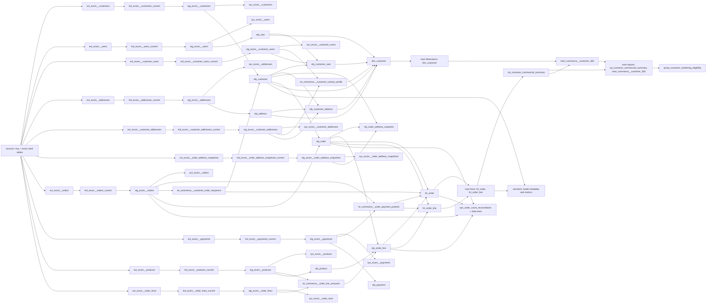
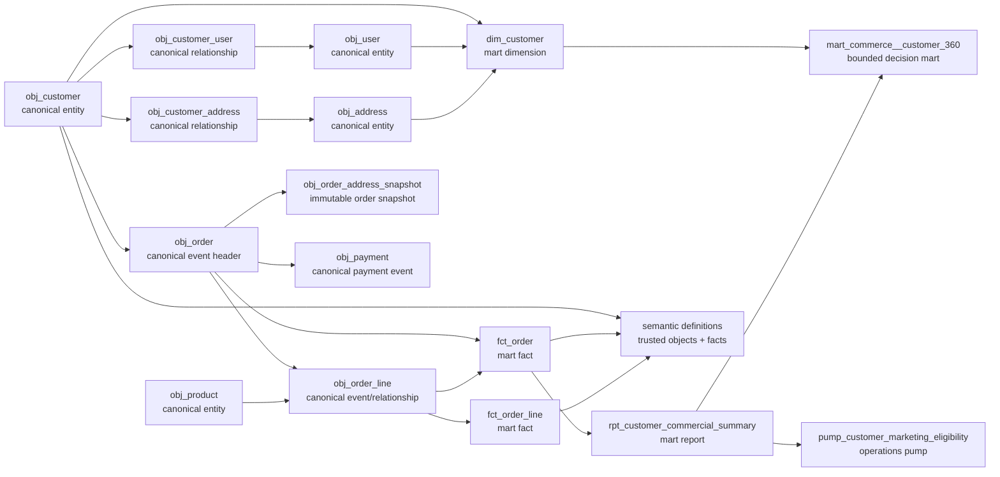

# Layered dbt Reference Architecture

This project is a compact reference implementation of a governed dbt architecture:

```text
Source / JSON landing -> landing -> staging
                                      |-> systems
                                      `-> logical -> objects -> marts
                                                           |-> operations / pumps
                                                           `-> semantic
```

The original Jaffle Shop starter staging and mart models have been removed from the active model estate. The active project has one unambiguous staging path and one unambiguous mart layer.

## Layer Purpose And Allowed Dependencies

| Layer | Purpose | Allowed upstream dependencies |
| --- | --- | --- |
| Source / JSON landing | Source-faithful semi-structured CDC records with extraction and ingestion metadata. | `source()` only |
| landing | Current trusted source record selected from CDC events. | Source / JSON landing |
| staging | Source-specific renames, casts, standardisation, and source metadata. | landing |
| systems | Controlled access views over current, source-conformed staging data. This branch never feeds logical, objects, marts, pumps, or semantic. | staging only |
| logical | Reusable intermediate transformations: joins, reconciliation, sequencing, and derived states. | staging |
| objects | Canonical durable business entities/events at stable grains. | staging and logical |
| marts | Analytical layer containing distinct facts, dimensions, and reports. | objects, logical, and other marts where a bounded report/mart composes governed mart models |
| operations | Data quality, reconciliation, freshness, observability, and pumps. | controls may reference multiple layers; pumps may reference purpose-specific marts/reports only |
| semantic | Metric and entity definitions. | trusted canonical objects and mart facts only |

## Lineage



## Declared Model Grains

| Model | Grain |
| --- | --- |
| `ext_ecom__customers` | One source customer CDC event |
| `ext_ecom__users` | One source user CDC event |
| `ext_ecom__customer_users` | One source customer-user relationship CDC event |
| `ext_ecom__addresses` | One source address CDC event |
| `ext_ecom__customer_addresses` | One source customer-address relationship CDC event |
| `ext_ecom__order_address_snapshots` | One source order address snapshot CDC event |
| `ext_ecom__orders` | One source order CDC event |
| `ext_ecom__payments` | One source payment CDC event |
| `ext_ecom__products` | One source product CDC event |
| `ext_ecom__order_lines` | One source order-line CDC event |
| `lnd_ecom__customers_current` | One current source customer key |
| `lnd_ecom__users_current` | One current source user key |
| `lnd_ecom__customer_users_current` | One current source customer-user relationship key |
| `lnd_ecom__addresses_current` | One current source address key |
| `lnd_ecom__customer_addresses_current` | One current source customer-address relationship key |
| `lnd_ecom__order_address_snapshots_current` | One current source order address snapshot key |
| `lnd_ecom__orders_current` | One current source order key |
| `lnd_ecom__payments_current` | One current source payment key |
| `lnd_ecom__products_current` | One current source product key |
| `lnd_ecom__order_lines_current` | One current source order-line key |
| `stg_ecom__customers` | One current ecom customer |
| `stg_ecom__users` | One current ecom user |
| `stg_ecom__customer_users` | One current ecom customer-user relationship |
| `stg_ecom__addresses` | One current ecom address |
| `stg_ecom__customer_addresses` | One current ecom customer-address relationship |
| `stg_ecom__order_address_snapshots` | One current ecom order address snapshot |
| `stg_ecom__orders` | One current ecom order |
| `stg_ecom__payments` | One current ecom payment |
| `stg_ecom__products` | One current ecom product |
| `stg_ecom__order_lines` | One current ecom order line |
| `sys_ecom__customers` | One current ecom customer, projected from staging |
| `sys_ecom__users` | One current ecom user, projected from staging |
| `sys_ecom__customer_users` | One current ecom customer-user relationship, projected from staging |
| `sys_ecom__addresses` | One current ecom address, projected from staging |
| `sys_ecom__customer_addresses` | One current ecom customer-address relationship, projected from staging |
| `sys_ecom__order_address_snapshots` | One current ecom order address snapshot, projected from staging |
| `sys_ecom__orders` | One current ecom order, projected from staging |
| `sys_ecom__payments` | One current ecom payment, projected from staging |
| `sys_ecom__products` | One current ecom product, projected from staging |
| `sys_ecom__order_lines` | One current ecom order line, projected from staging |
| `int_commerce__order_payment_position` | One order payment position |
| `int_commerce__customer_order_sequence` | One order in customer sequence |
| `int_commerce__order_line_amounts` | One order line with at-purchase amount logic |
| `int_commerce__customer_contact_profile` | One customer current contact/address relationship selection |
| `obj_customer` | One canonical customer |
| `obj_user` | One canonical user |
| `obj_customer_user` | One canonical customer-user relationship |
| `obj_address` | One canonical address |
| `obj_customer_address` | One canonical customer-address relationship |
| `obj_order_address_snapshot` | One immutable order address snapshot |
| `obj_order` | One canonical order |
| `obj_payment` | One canonical payment |
| `obj_product` | One canonical product |
| `obj_order_line` | One canonical order line |
| `fct_order` | One order |
| `fct_order_line` | One order line |
| `dim_customer` | One current analytical customer dimension row |
| `rpt_customer_commercial_summary` | One customer commercial summary |
| `mart_commerce__customer_360` | One bounded Customer 360 row |
| `pump_customer_marketing_eligibility` | One customer audience identity |
| `sem_metricflow_time_spine` | One calendar day for semantic metric joins |
| `ops_order_count_reconciliation` | One reconciliation result |

## Model Classifications

| Model | Grain | Class | Status | Intended consumers |
| --- | --- | --- | --- | --- |
| `obj_customer` | One customer | canonical object/entity | reusable | objects, mart facts, semantic definitions |
| `obj_user` | One user | canonical object/entity | reusable | objects, mart dimensions |
| `obj_customer_user` | One customer-user relationship | canonical object/relationship | reusable | objects, mart dimensions |
| `obj_address` | One address | canonical object/entity | reusable | objects, mart dimensions |
| `obj_customer_address` | One customer-address relationship | canonical object/relationship | reusable | objects, mart dimensions |
| `obj_order_address_snapshot` | One order address snapshot | canonical object/event snapshot | reusable | objects, mart facts |
| `obj_product` | One product | canonical object/entity | reusable | objects, mart facts, semantic definitions |
| `obj_order` | One order | canonical object/event header | reusable | objects, mart facts, semantic definitions |
| `obj_order_line` | One order line | canonical object/event/relationship | reusable | mart facts, semantic definitions |
| `obj_payment` | One payment | canonical payment event | reusable | objects, mart facts, operations controls |
| `fct_order` | One order | conformed analytical fact | canonical/reusable | analytics, reports, semantic definitions |
| `fct_order_line` | One order line | conformed analytical fact | canonical/reusable | analytics, reports, semantic definitions |
| `dim_customer` | One customer | analytical dimension | purpose-specific analytical shape | analytics, reports |
| `rpt_customer_commercial_summary` | One customer commercial summary | analytical report | purpose-specific | business reporting, operations pumps |
| `mart_commerce__customer_360` | One customer | analytical decision mart | purpose-specific | customer 360 review, business operations |

## Why Each Transformation Belongs Where It Is

The Source / JSON landing layer constructs JSON/CDC-shaped records from explicit ecom seed tables and keeps ingestion metadata next to extracted JSON fields. It does not interpret business meaning. Products and order lines use the existing `raw_products` and `raw_items` seeds; because `raw_items` is one row per purchased item, the synthetic order-line payload sets `quantity` to `1`. Users, customer-user relationships, addresses, customer-address relationships, and immutable order address snapshots are now first-class raw seed tables generated deterministically for the architecture playground, then ingested through their own external models.

The landing layer is the only place that resolves CDC currentness. The selected row wins by `source_updated_at desc, ingested_at desc, ingestion_event_id desc`, which is deterministic and covered by a unit test.

The staging layer makes records usable with renamed columns, casts, standardised text, and useful source metadata. It does not join sources or calculate business metrics.

The systems branch exists only for controlled access to current source-conformed datasets without granting private staging access. Every system model is a materialized view and a direct `dbt_utils.star()` projection of one staging model.

Systems is a terminal access branch in this reference. It never feeds logical, objects, marts, pumps, or semantic definitions.

The logical layer owns reusable intermediate transformations. Order/payment position, customer order sequence, order-line amount calculation, and current customer contact/address relationship selection are not consumer-facing, but they centralize joins, sequencing, reconciliation, and derived states so objects and marts do not duplicate them. Payment completeness, operational status, commercial status, completion flags, and overpayment flags are based on captured payment value only; pending payment attempts remain diagnostics and do not create settled revenue. Zero-value orders are classified explicitly as `no_charge` / `not_required` and are not counted as completed revenue events.

The objects layer declares canonical durable entities, relationships, and events. Some canonical objects remain intentionally narrow in this compact reference, but they are the intended stable interfaces when additional systems are introduced. `obj_customer` remains the canonical Customer identity anchor, while `obj_user`, `obj_customer_user`, `obj_address`, `obj_customer_address`, and `obj_order_address_snapshot` show that contact and address modeling belongs in explicit objects and relationship objects rather than hidden inside a customer table.

Customer key lineage is canonicalized in objects: staging customer records generate `obj_customer.customer_sk`; staging order records join to `obj_customer` and carry `obj_order.customer_sk`; `fct_order.customer_sk` is selected from `obj_order` and never regenerated in the mart.

Product/order-line key lineage is also canonicalized in objects: staging product records generate `obj_product.product_sk`; staging order-line records join through `obj_order` and `obj_product` so `obj_order_line` carries canonical `order_sk` and `product_sk`; `fct_order_line` and the order-level line measures in `fct_order` consume those object keys rather than regenerating them.

The marts layer contains analytical facts, dimensions, and bounded reports as distinct model types. This reference has conformed facts (`fct_order`, `fct_order_line`), a deliberately shaped analytical customer dimension (`dim_customer`), a commercial summary report (`rpt_customer_commercial_summary`), and a bounded Customer 360 decision mart (`mart_commerce__customer_360`). `dim_customer` exists because it resolves current contact/address attributes through canonical identity and relationship objects for analytical consumption; it does not replace `obj_customer` as the canonical identity/relationship anchor.

The pump under operations is a narrow, frozen, machine-consumed delivery contract. It consumes only purpose-specific mart reports, exposes `_pumped_at`, enforces a dbt contract with explicit column types, and documents its consumer, grain, refresh expectation, required fields, exclusions, and owner placeholder.

The semantic layer is physically separate under `models/5. semantic/`. It uses dbt Core 1.12+ model-attached `semantic_model` metadata on governed models: `obj_customer` for the Customer entity and attributes, `fct_order` for Order metrics and time-based analysis, and `fct_order_line` for line-grain analysis with canonical Order and Product foreign entities. The semantic YAML uses trusted objects and mart facts only; it does not reference staging, systems, logical, landing, or Source / JSON landing models. Metric `config.meta.permitted_dimensions` lists the intended governed dimensions/entities for each metric so the permission model is explicit in metadata as well as prose.

Operations controls make failures useful: reconciliation catches accidental filtering/fanout, landing key tests catch broken CDC currentness, payment tests catch captured overpayment exceptions, zero-value order tests protect completed revenue metrics, and source freshness demonstrates ingestion observability on fixture data.

## Canonical Commerce Relationship Map

Implemented now:



| Canonical object | Relationship intent |
| --- | --- |
| `obj_customer` | Canonical Customer entity and sole authority for `customer_sk`. |
| `obj_user` | Canonical User entity. Users relate to customers through `obj_customer_user`; they are not assumed to belong to exactly one customer. |
| `obj_customer_user` | Canonical Customer-User relationship carrying `customer_sk` and `user_sk`. |
| `obj_address` | Canonical Address entity for mutable/current address concepts. |
| `obj_customer_address` | Canonical Customer-Address relationship carrying `customer_sk` and `address_sk`. |
| `obj_order_address_snapshot` | Immutable Order Address Snapshot captured at purchase time; orders do not rely on mutable current addresses for historical delivery context. |
| `obj_order` | Canonical Order event carrying `customer_sk` from `obj_customer`. |
| `obj_order_line` | Canonical Order Line event carrying `order_sk` from `obj_order` and `product_sk` from `obj_product`. |
| `obj_product` | Canonical Product entity and sole authority for `product_sk`. |
| `obj_payment` | Canonical Payment event that belongs to Order. Payment should not redundantly carry Customer or Product keys. |

Modeled pattern guardrails:

| Pattern | Guidance |
| --- | --- |
| User / Customer-User | A User is related to Customer through `obj_customer_user`, not assumed to belong to exactly one customer. |
| Address / Customer-Address | Mutable current addresses are modeled separately from customers through `obj_customer_address`. |
| Immutable Order Address Snapshot | An order must retain the address snapshot used at purchase time rather than relying on a mutable current address. |
